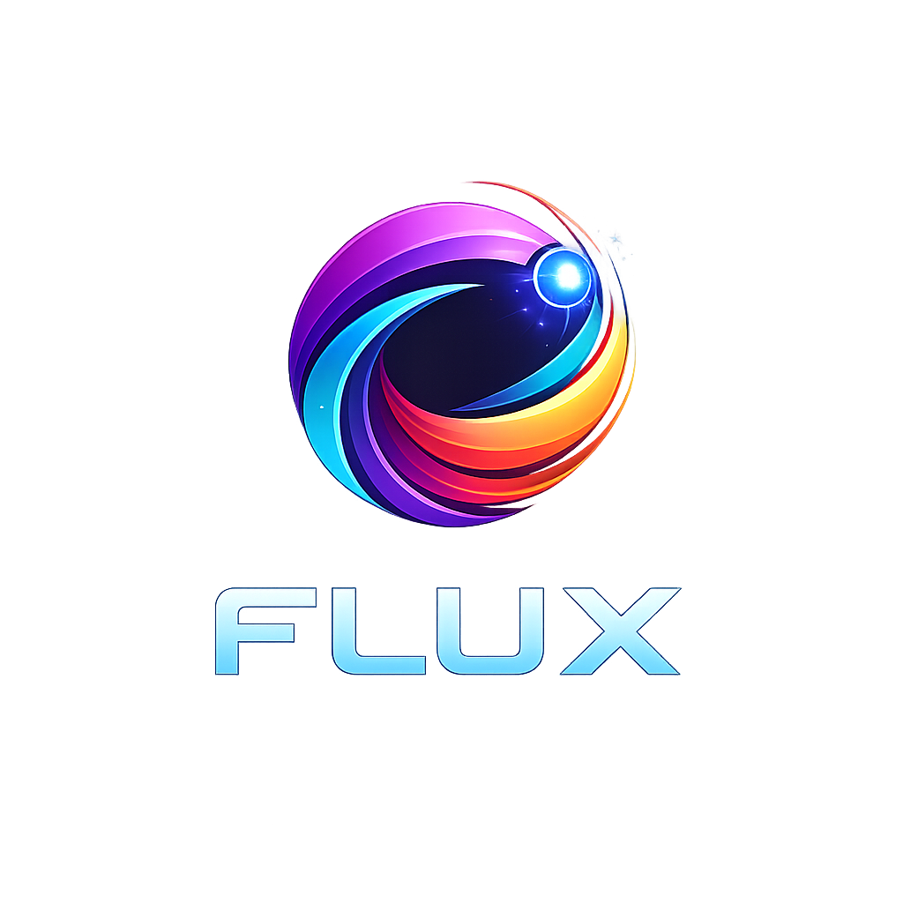

# FLUX Browser

<div align="center">



### Ein futuristischer, plattformübergreifender Browser
**gebaut mit Electron · Windows · macOS · Linux**


</div>

---

## Inhaltsverzeichnis

- [Über FLUX](#über-flux)
- [Features](#features)
- [Screenshots](#screenshots)
- [Voraussetzungen](#voraussetzungen)
- [Installation](#installation)
- [Nutzung](#nutzung)
- [Tastenkürzel](#tastenkürzel)
- [Projektstruktur](#projektstruktur)
- [Architektur](#architektur)
- [Build & Distribution](#build--distribution)
- [Anpassen](#anpassen)
- [Sicherheit](#sicherheit)
- [Lizenz](#lizenz)

---

## Über FLUX

FLUX ist ein selbst gebauter Desktop-Browser auf Basis von [Electron](https://www.electronjs.org/). Er kombiniert die Rendering-Engine von Chromium mit einer eigenen, futuristischen Benutzeroberfläche im Cyberpunk-Stil – lila, cyan und orange, abgestimmt auf das FLUX-Logo.

Das Projekt richtet sich an Entwickler, die verstehen wollen, wie Browser intern aufgebaut sind, oder die einen eigenen Browser als Grundlage für spezialisierte Anwendungen nutzen möchten (Kiosk-Systeme, White-Label-Browser, interne Tools).

---

## Features

- **Vollständiges Tab-Management** – Tabs öffnen, schließen und wechseln
- **Eigene Startseite** – Logo, lebende Uhrzeit, Suchleiste und Quick-Links
- **Futuristisches UI** – Cyberpunk-Design mit Neon-Glow-Effekten, Glassmorphism und animierten Elementen
- **Eigene Titelleiste** – Rahmenlos mit eigenen Minimize/Maximize/Close-Buttons
- **Sicherheitsarchitektur** – `contextIsolation`, kein `nodeIntegration`, Preload-Bridge, CSP
- **Ladebalken** – Realistischer Fortschrittsbalken mit Shimmer-Effekt
- **Statusleiste** – Zeigt Hover-URLs und Browser-Version
- **Plattformübergreifend** – läuft auf Windows, macOS und Linux ohne Codeänderungen
- **Keyboard Shortcuts** – vollständige Tastatursteuerung

---

## Screenshots

> _Starte die App mit `npm start` und mache eigene Screenshots._

---

## Voraussetzungen

| Software | Mindestversion | Download |
|----------|---------------|---------|
| Node.js  | 18.x          | [nodejs.org](https://nodejs.org) |
| npm      | 9.x           | wird mit Node.js mitgeliefert |
| Git      | beliebig      | [git-scm.com](https://git-scm.com) |

---

## Installation

```bash
# 1. Repository klonen (oder Dateien herunterladen)
git clone https://github.com/dein-name/flux-browser.git
cd flux-browser

# 2. Abhängigkeiten installieren
npm install

# 3. Browser starten
npm start
```

> **Windows-Hinweis:** Falls Electron beim ersten Start einen Sicherheitsdialog zeigt, auf „Trotzdem ausführen" klicken.

---

## Nutzung

Nach dem Start öffnet sich FLUX direkt mit der eigenen Startseite. Von dort aus:

- **URL eingeben** – in die Adressleiste klicken und URL oder Suchbegriff eingeben, Enter drücken
- **Neuer Tab** – `+`-Button in der Tab-Leiste oder `Ctrl+T`
- **Suchen** – beliebigen Text in die Adress- oder Startseiten-Suchleiste eingeben → automatische Google-Suche
- **Quick-Links** – auf der Startseite direkt zu den wichtigsten Seiten springen

---

## Tastenkürzel

| Kürzel | Aktion |
|--------|--------|
| `Ctrl + T` | Neuer Tab |
| `Ctrl + W` | Aktiven Tab schließen |
| `Ctrl + L` | Adressleiste fokussieren |
| `F5` / `Ctrl + R` | Seite neu laden |
| `Alt + ←` | Zurück |
| `Alt + →` | Vorwärts |
| `Ctrl + 1–9` | Tab 1–9 direkt aktivieren |

---

## Projektstruktur

```
flux-browser/
│
├── main.js              # Main Process – Fenster, IPC, Sicherheit
├── preload.js           # Preload Script – sichere Bridge zu Node.js
├── package.json         # Projekt-Metadaten & npm-Scripts
├── forge.config.js      # Electron Forge Build-Konfiguration (optional)
│
├── renderer/            # Renderer Process – die Benutzeroberfläche
│   ├── index.html       # HTML-Struktur der Browser-Shell
│   ├── renderer.js      # UI-Logik: Tabs, Navigation, Events
│   ├── style.css        # Futuristisches Cyberpunk-Design
│   └── flux.png         # App-Logo
│
├── README.md
├── LICENSE.md
└── CHANGELOG.md
```

---

## Architektur

FLUX folgt der strikten Electron-Zwei-Prozess-Architektur:

```
┌─────────────────────────────────────────────────┐
│                  Main Process                    │
│  Node.js + Electron API                         │
│  • BrowserWindow erstellen                      │
│  • IPC-Nachrichten verarbeiten                  │
│  • Native OS-APIs (Menü, Tray, Dialoge)         │
└────────────────┬────────────────────────────────┘
                 │  IPC (ipcMain / ipcRenderer)
                 │  über contextBridge (sicher)
┌────────────────▼────────────────────────────────┐
│               Renderer Process                   │
│  Chromium + Web APIs                            │
│  • Browser-UI (HTML/CSS/JS)                     │
│  • Tab-Verwaltung                               │
│  • Navigation                                   │
└────────────────┬────────────────────────────────┘
                 │  <webview> Tag (isolierter Prozess)
┌────────────────▼────────────────────────────────┐
│             WebView Prozess(e)                   │
│  • Geladene Webseiten                           │
│  • Komplett sandboxed                           │
│  • Kein Zugriff auf App-Internals               │
└─────────────────────────────────────────────────┘
```

**Warum `contextIsolation: true`?**
Ohne diese Option könnte jede geladene Webseite über `window` auf Node.js-APIs zugreifen und z.B. Dateien lesen oder Prozesse starten. Mit `contextIsolation` sind die JavaScript-Kontexte vollständig getrennt.

**Warum `preload.js`?**
Das Preload-Script ist die einzige erlaubte Brücke. Es läuft in einem privilegierten Kontext und gibt über `contextBridge.exposeInMainWorld()` nur explizit definierte, sichere Methoden an den Renderer weiter.

---

## Build & Distribution

### Voraussetzungen

```bash
npm install --save-dev @electron-forge/cli @electron-forge/maker-squirrel @electron-forge/maker-zip
```

### `forge.config.js` anlegen

```js
module.exports = {
  packagerConfig: {
    name: 'FLUX Browser',
    executableName: 'flux-browser',
    icon: './renderer/flux',   // .ico / .icns wird automatisch ergänzt
  },
  makers: [
    {
      name: '@electron-forge/maker-squirrel',  // Windows .exe Installer
      config: {
        name: 'flux_browser',
        setupIcon: './renderer/flux.ico',
      },
    },
    {
      name: '@electron-forge/maker-zip',       // macOS & Linux .zip
    },
  ],
}
```

### Build ausführen

```bash
npm run make
```

Die fertigen Pakete landen in `out/make/`. Für Windows wird eine `.exe`-Installationsdatei erstellt.

> **Icon-Hinweis:** Für Windows wird eine `.ico`-Datei benötigt. `flux.png` kann kostenlos auf [cloudconvert.com](https://cloudconvert.com/png-to-ico) konvertiert werden.

---

## Anpassen

### Quick-Links auf der Startseite ändern

In `renderer/renderer.js`, Funktion `showNewTabPage()`, das Array `quickLinks` anpassen:

```js
const quickLinks = [
  { label: 'Google',  url: 'https://google.com',  icon: 'G' },
  { label: 'Deine Seite', url: 'https://deine-url.de', icon: '★' },
  // weitere Einträge...
]
```

### Startseite nach dem Öffnen ändern

In `renderer/renderer.js` ganz unten:

```js
// Eigene URL statt Startseite:
createTab('https://deine-startseite.de')

// Oder Startseite anzeigen (Standard):
createTab(null)
```

### Farben anpassen

Alle Farben sind als CSS-Variablen in `renderer/style.css` unter `:root { ... }` definiert und können dort zentral geändert werden.

---

## Sicherheit

FLUX implementiert alle von Electron empfohlenen Sicherheits-Best-Practices:

| Maßnahme | Status | Beschreibung |
|----------|--------|-------------|
| `contextIsolation` | ✅ aktiv | JS-Kontexte sind strikt getrennt |
| `nodeIntegration` | ✅ deaktiviert | Kein Node.js-Zugriff im Renderer |
| `webSecurity` | ✅ aktiv | Same-Origin-Policy wird durchgesetzt |
| `allowpopups` | ✅ deaktiviert | Keine automatischen Popup-Fenster |
| Content Security Policy | ✅ gesetzt | Eingeschränkte Ressourcen für die App-Shell |
| Preload-Bridge | ✅ | Nur explizit freigegebene APIs erreichbar |

Weitere Informationen: [Electron Security Documentation](https://www.electronjs.org/docs/latest/tutorial/security)

---

## Lizenz

MIT – siehe [LICENSE.md](LICENSE.MD)